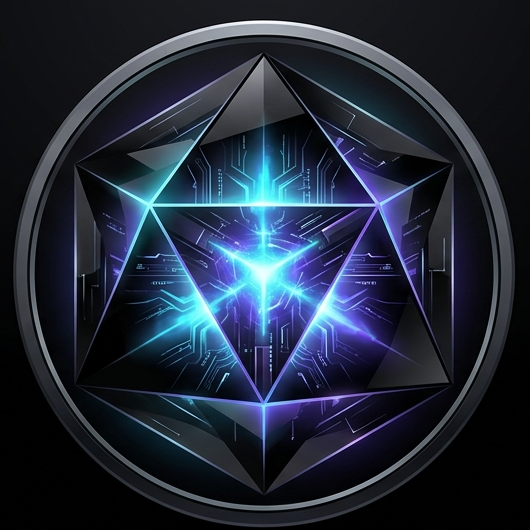

  
  <h1>ONYX ✦ Autonomous AI Interviewer</h1>
  
<strong>Architected by Lakshan Muruganandam</strong>

  
An elite, adaptive AI technical interviewer designed to evaluate FAANG-level engineering talent without bias, complete with enterprise-grade proctoring and career coaching.

   
  <h2>🚀 <a href="https://onyx-ai-seven.vercel.app" target="_blank"><strong>WE HAVE A FULLY WORKING LIVE DEMO! TRY IT HERE</strong></a> 🚀</h2>
  
<em>Experience the future of technical hiring right now in your browser.</em>

   

## 🎬 Full Demo Video
*(Turn on your audio! This video demonstrates the full end-to-end capabilities of the ONYX AI Interviewer)*

https://github.com/lakshanmuruganandam/onyx-ai/raw/main/FINAL.mp4

*(If the video player doesn't load immediately above, [click here to watch the raw video](https://github.com/lakshanmuruganandam/onyx-ai/raw/main/FINAL.mp4))*

## 🚀 The Core Innovations

### 1. Invincible Fallback Architecture (100% Uptime Guarantee)
To ensure absolute reliability in enterprise hackathon environments, ONYX is built on a 3-tier cascading AI architecture:
*   **Tier 1 (Primary):** Powered by **Google Gemini 2.5 Flash**, delivering sub-second, highly contextual reasoning.
*   **Tier 2 (Failover):** If the primary API rate-limits or fails, the Node.js backend intercepts the `400/500` error and silently reroutes the payload to **Meta Llama 3.3 70B via OpenRouter**.
*   **Tier 3 (Safety Net):** In the event of a total API blackout, the system drops to a deterministic mock-state generator, ensuring the frontend UI never crashes during a live demo.

### 2. Adaptive State Logic Engine
ONYX does not ask a static list of questions. It behaves like a Principal Engineer.
*   **Contextual Initialization:** It ingests the candidate's Resume and the target Job Description (JD) to formulate a hyper-specific opening technical scenario.
*   **The 5-Axis Evaluation:** Every single answer is scored across 5 deterministic metrics: *Accuracy, Clarity, Depth, Relevance, and Time Efficiency*.
*   **Dynamic Pivot & The Guillotine:** If a candidate demonstrates mastery (Score > 85%), ONYX escalates to "Hard Mode" to test architectural limits. If accuracy drops too low consecutively, ONYX triggers **Early Termination** to save engineering hours.

### 3. Anti-Cheating & Proctoring Suite
ONYX enforces a strict, zero-trust interview environment:
*   **Tab Tracking:** Detects document `visibilitychange` and permanently logs if the candidate leaves the interview tab.
*   **Clipboard Blocking:** Disables `copy`, `paste`, and `cut` events globally.
*   **Context Menu Locking:** Right-click and native browser shortcuts (Ctrl+C, Cmd+V) are neutralized.
*   **Live Proctor Flags:** The interviewer UI displays a red badge counting every single integrity violation in real-time. If flags exceed the threshold, the AI autonomously terminates the interview.

### 4. Live Audio/Video & Code Workspace
*   **WebRTC Integration:** Live mirrored webcam feed with a recording indicator.
*   **Audio Waveforms:** The AI Interviewer avatar dynamically pulses using 7 independent audio bars when generating voice output.
*   **Technical Scratchpad:** Candidates are provided an integrated code sandbox to type pseudo-code alongside their spoken answers.

### 5. Elite Career Coach Diagnostics
When the interview concludes, ONYX drops the "Interviewer" persona and generates a massively detailed JSON payload that acts as a Principal Engineering Career Coach:
*   **Technical Upgrades:** Pinpoints exact architectural concepts (e.g., *LSM-Trees vs B-Trees, Paxos consensus*) the candidate failed on.
*   **Resume Rewrites:** Instructs the candidate exactly how to rewrite specific bullet points using the XYZ metric formula to pass ATS systems based on the interview data.
*   **Action Plan:** Provides a tailored, actionable roadmap to guarantee an offer on the next attempt.

### 6. "Obsidian & Plasma" Aesthetic
*   Engineered using React, Vite, and Tailwind CSS.
*   Features a high-performance **Framer Motion** particle background.
*   **Glassmorphism Engine:** Translucent cards with `backdrop-blur`, inner shadows, and metallic hover states designed to mimic high-end cybernetic interfaces.

## 🛠️ Tech Stack & Vercel Monorepo
*   **Frontend:** React (TypeScript), Vite, Tailwind CSS, Framer Motion, Lucide Icons.
*   **Backend:** Node.js, Express.js (Deployed seamlessly as Vercel Serverless Functions).
*   **AI Engine:** Google Generative AI SDK, OpenRouter REST API.

## ⚡ Deployment & Local Setup
ONYX is configured for seamless monorepo deployment on **Vercel** via a root `vercel.json` file.

### Local Development
1. Clone the repository.
2. `cd frontend && npm install`
3. `cd backend && npm install`
4. Add your `.env` keys in the backend directory.
5. Run the frontend: `npm run dev`
6. Run the backend: `node server.js`

---

  <i>Built to redefine autonomous technical recruiting.</i>

